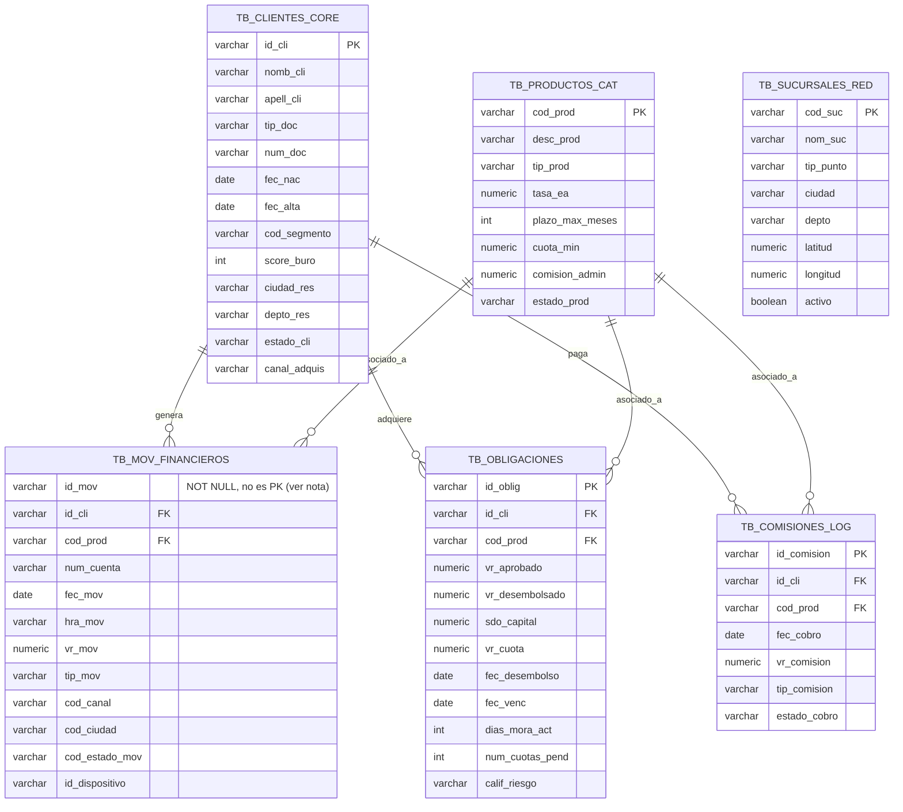

# Diagrama Entidad-Relación — Tablas fuente FinBank (Escenario A)

Modelo de la base relacional origen (Fase 1), tal como se genera y se
carga en `data-generation/`. Nomenclatura idéntica a la del sistema legado
de FinBank, según el enunciado.

## Notas del modelo

- **`TB_SUCURSALES_RED` no tiene FK entrante desde las tablas de hechos**
  en el modelo fuente (los movimientos se relacionan por `cod_canal` /
  `cod_ciudad`, no por `cod_suc`). En la capa Gold se deriva de aquí
  `dim_geografia` y `dim_canal` de forma independiente — ver
  `PLAN.md`, Fase 3.
- **`id_mov` no es llave primaria a nivel de base de datos.** Es
  intencional: el dataset sintético incluye duplicados exactos (misma PK)
  como una de las anomalías controladas (ver `data-generation/ANOMALIES.md`),
  para ejercitar la deduplicación en la capa Silver.
- **No se declaran `FOREIGN KEY` en `TB_MOV_FINANCIEROS` ni
  `TB_COMISIONES_LOG`** hacia clientes/productos — el dataset incluye
  `id_cli` huérfanos a propósito, y su detección es responsabilidad
  explícita de la validación de integridad referencial en Silver.
- Cardinalidad `||--o{`: un cliente/producto puede tener cero o muchos
  movimientos/obligaciones/comisiones; cada movimiento/obligación/comisión
  pertenece exactamente a un cliente y a un producto (cuando el dato es
  íntegro).
